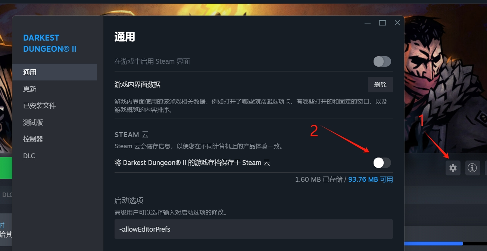
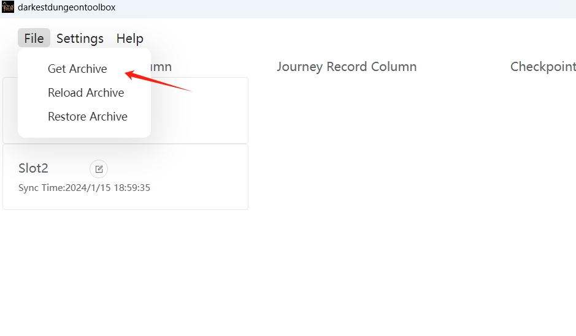
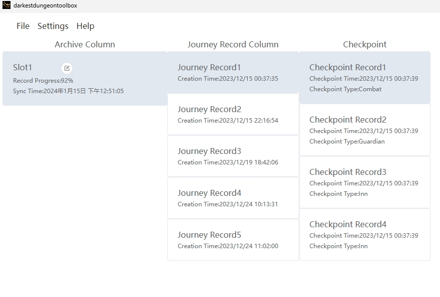
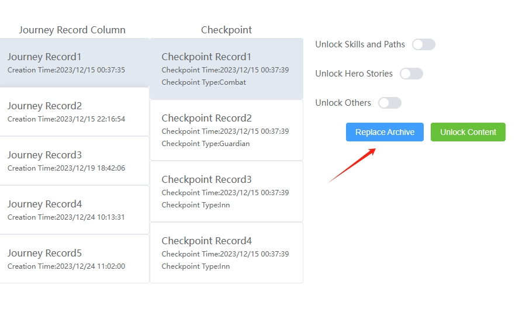

# Being From Beyond
You can go back through your archives
## Use
1. Turn off archive cloud synchronous

2. Exit the game to the main menu every time you want to go back to the archive
3. Click file menu and click get archive to get the latest archive

4. Click the archive, travel and checkpoint to choose the checkpoint that you want to go back through

5. Click replace archive

6. Re-enter your game