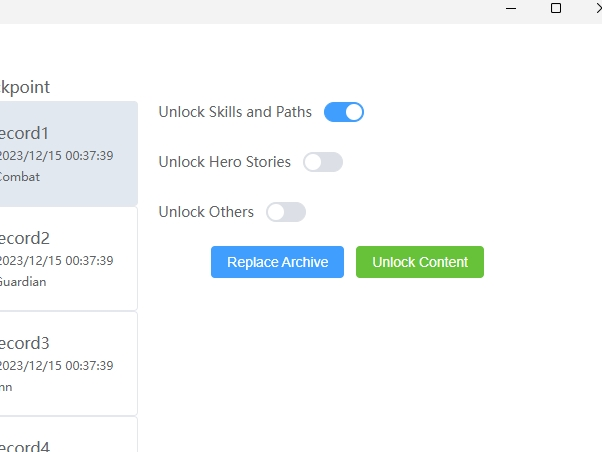
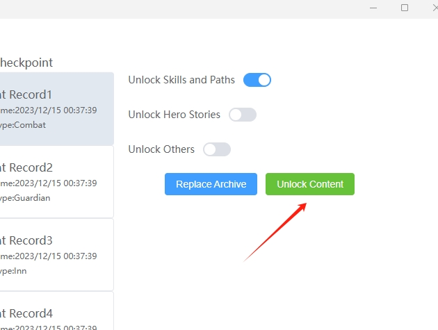

# Unlock Everything
You can unlock skill and more
## Use
1. Turn off archive cloud synchronous

2. Exit the game to desktop
3. select the content you want to unlock.

4. Click unlock content.

5. Re-enter game
::: danger
Since we don't know the basic operating logic of the game, this action may cause damage to your archive. If your game doesn't work, please click Restore Archive.Click top menu **File**, and then click **restore archive**.If this method also fails, please re-enable the archive cloud synchronization. After a document conflict, then select the cloud archive.
:::